# Manual del Programador — Buscador de Servicios con IA


> Plataforma de búsqueda en **Laravel + MySQL** que recupera candidatos con **FULLTEXT/LIKE** y re–ranquea con **IA**.  
> **Score final** = `0.70 × IA + 0.20 × proximidad + 0.10 × rating`.

---

## Índice

1. [Descripción técnica](#1-descripción-técnica)  
2. [Requisitos y entorno](#2-requisitos-y-entorno)  
3. [Instalación](#3-instalación)  
4. [Variables .env](#4-variables-env)  
5. [Estructura del proyecto](#5-estructura-del-proyecto)  
6. [Esquema de Base de Datos](#6-esquema-de-base-de-datos)  
7. [Índices recomendados](#7-índices-recomendados)  
8. [API Contract](#8-api-contract)  
9. [Lógica y scoring](#9-lógica-y-scoring)  
10. [Seguridad y buenas prácticas](#10-seguridad-y-buenas-prácticas)  
11. [Mantenimiento y pruebas](#11-mantenimiento-y-pruebas)  
12. [Checklist de entrega (QA)](#12-checklist-de-entrega-qa)

---

## 1) Descripción técnica

**Flujo general**
1. **Candidatos**: consulta **FULLTEXT** (o **LIKE** como fallback) sobre `services.titulo` y `services.descripcion`, con **cascada** de filtros (categoría/barrio).  
2. **Re-ranking IA (Cohere/Jina)**: se envía el **Top-K** de candidatos; la IA devuelve **relevancias** por índice.  
3. **Puntuación final**:  
   ```text
   final = 0.70 * ia_norm + 0.20 * proximidad + 0.10 * rating_norm
   ```
4. **Fallback**: si IA falla (timeout/401/429), se usa el **score textual normalizado** y se continúa igual.

> 💡 **Nota**: proximidad se calcula con Haversine; rating se normaliza como `rating/5`.

---

## 2) Requisitos y entorno

- PHP **8.2+**, Composer, MySQL **8+**  
- Extensiones: `mbstring`, `openssl`, `pdo_mysql`, `curl`  
- **Windows (solo si aparece error SSL/cURL 60)**  
  Coloca `cacert.pem` en `storage/certs/cacert.pem` y en `php.ini` define:
  ```ini
  curl.cainfo="C:\ruta\al\proyecto\storage\certs\cacert.pem"
  openssl.cafile="C:\ruta\al\proyecto\storage\certs\cacert.pem"
  ```

---

## 3) Instalación

```bash
composer install
cp .env.example .env
php artisan key:generate

# Configura DB y RERANK_* en .env
php artisan migrate --seed

php artisan serve --host=127.0.0.1 --port=8001
# UI:   http://127.0.0.1:8001/
# Demo: http://127.0.0.1:8001/demo.html
```

---

## 4) Variables .env

**Base de datos**
```dotenv
DB_CONNECTION=mysql
DB_HOST=127.0.0.1
DB_PORT=3306
DB_DATABASE=ia_local
DB_USERNAME=root
DB_PASSWORD=
```

**Re-ranking (Cohere)**
```dotenv
RERANK_PROVIDER=cohere
RERANK_URL=https://api.cohere.ai/v1/rerank
RERANK_KEY=TU_API_KEY
RERANK_MODEL=rerank-multilingual-v3.0
```

> 🔒 **Importante**: no versionar `.env` ni llaves. Tras cambios: `php artisan config:clear`.

---

## 5) Estructura del proyecto

```
app/
  Http/Controllers/SearchController.php   # Búsqueda, cascada FT/LIKE, IA, scoring
config/
  services.php                            # Config 'rerank' (provider/url/key/model)
database/
  migrations/                             # Esquema
  seeders/                                # Datos de ejemplo coherentes por categoría
public/
  demo.html                               # Entregable demo
  demo.js
resources/views/app.blade.php             # UI principal
routes/api.php                            # /api/search, /api/ia-test, /api/health
storage/
  certs/cacert.pem                        # (Windows) SSL
```

---

## 6) Esquema de Base de Datos

### Tabla `providers`

| Campo            | Tipo                | Notas                      |
|------------------|---------------------|----------------------------|
| `id`             | PK                  |                            |
| `nombre`         | varchar             |                            |
| `barrio`         | varchar             |                            |
| `lat`            | decimal (nullable)  |                            |
| `lon`            | decimal (nullable)  |                            |
| `rating_promedio`| decimal             | 0–5                        |
| `created_at`     | timestamp           |                            |
| `updated_at`     | timestamp           |                            |

### Tabla `services`

| Campo         | Tipo               | Notas                              |
|---------------|--------------------|------------------------------------|
| `id`          | PK                 |                                    |
| `provider_id` | FK → `providers.id`|                                    |
| `categoria`   | varchar            |                                    |
| `titulo`      | varchar            |                                    |
| `descripcion` | text               |                                    |
| `precio_desde`| decimal (nullable) |                                    |
| `activo`      | tinyint            | 1 = visible                         |
| `created_at`  | timestamp          |                                    |
| `updated_at`  | timestamp          |                                    |

---

## 7) Índices recomendados

```sql
ALTER TABLE services  ADD FULLTEXT ft_txt (titulo, descripcion);
CREATE INDEX idx_services_categoria ON services (categoria);
CREATE INDEX idx_providers_barrio  ON providers (barrio);
```

---

## 8) API Contract

### `POST /api/search`

**Request (JSON)**
```json
{
  "query": "instalar cámaras",
  "categoria": null,
  "barrio": null,
  "k": 8,
  "user_lat": null,
  "user_lon": null,
  "use_ia": true
}
```

**Response (ejemplo)**
```json
{
  "items": [
    {
      "id": 19,
      "titulo": "Seguridad - Seguridad Hogar Plus",
      "descripcion": "Instalación de cámaras Hikvision/DAHUA, cableado, DVR/NVR, app móvil.",
      "categoria": "Seguridad",
      "proveedor": "Seguridad Hogar Plus",
      "barrio": "San Rafael",
      "rating": 4.2,
      "ia_score": 1.0,
      "final_score": 0.884,
      "badges": ["Recomendado"]
    }
  ],
  "meta": {
    "query": "instalar cámaras",
    "estrategia": "FULLTEXT_*",
    "ia": { "proveedor": "cohere", "ok": true, "candidatos_enviados_a_ia": 6 }
  }
}
```

**Estados**
- `200` OK (con o sin IA)
- `422` Validación (falta `query`, etc.)
- `5xx` Excepciones (ver logs)

### `GET /api/ia-test`
Diagnóstico rápido (valida `RERANK_URL` y `RERANK_KEY`).  
**Esperado**: `{ provider, status, raw }` con `status: 200`.

### `GET /api/health`
```json
{ "ok": true, "app": "…", "time": "…" }
```

---

## 9) Lógica y scoring

```mermaid
flowchart LR
    Q[Consulta del usuario] --> C{Cascada}
    C -->|FT cat+barrio| S1[Candidates]
    C -->|FT sin barrio| S2[Candidates]
    C -->|FT sin categoría| S3[Candidates]
    C -->|FT sin filtros| S4[Candidates]
    C -->|LIKE sin filtros| S5[Candidates]
    S1 --> IA[Re-ranker IA]
    S2 --> IA
    S3 --> IA
    S4 --> IA
    S5 --> IA
    IA --> SC[Scoring final = 0.70 IA + 0.20 prox + 0.10 rating]
    SC --> OUT[Ordenado y devuelto]
```



**Detalles**
- **Cascada**: FT con todos los filtros → ir relajando → LIKE como último recurso.  
- **IA**: normaliza a `[0..1]` asignando `1` al mejor candidato.  
- **Proximidad (Haversine)**:  
  `prox = max(0, 1 - (dist_km / 25))` (0–25 km aporta de 1 a 0).  
- **Rating**: `rating_norm = rating_promedio / 5`.  
- **Empates**: desempate por `rating_promedio DESC`.  
- **Fallback IA**: si falla, usar **score textual relativo**.

---

## 10) Seguridad y buenas prácticas

- 🚫 **Nunca** subir `.env` ni llaves de API.  
- ✅ Validar entradas (`query` min 2, `k` 1..50, `lat/lon` numéricos).  
- 💸 Limitar **Top-K** enviado a IA para costo/latencia.  
- 🧾 Loguear errores y tiempos (Laravel HTTP Client).  
- 🌐 Configurar **CORS** si la UI vive en otro dominio.  
- 🔁 Tras cambiar `.env`/`config`: `php artisan config:clear`.

---

## 11) Mantenimiento y pruebas

```bash
# Cachés
php artisan optimize:clear

# Logs (seguimiento)
tail -f storage/logs/laravel.log

# Reseed completo
php artisan migrate:fresh --seed

# Postman/Insomnia: probar /api/search con IA ON/OFF
```

---

## 12) Checklist de entrega (QA)

- [ ] `README.md` actualizado con uso y endpoints  
- [ ] `public/demo.html` y `public/demo.js` funcionales  
- [ ] `.env` configurado (DB + `RERANK_*`) y **no** versionado  
- [ ] `GET /api/ia-test` → **200**  
- [ ] `POST /api/search` → **200** (con y sin IA)  
- [ ] Desempeño OK con `k ≤ 8` y **6–10** candidatos a IA  
- [ ] Seeders cargados y **FULLTEXT** creado

---
